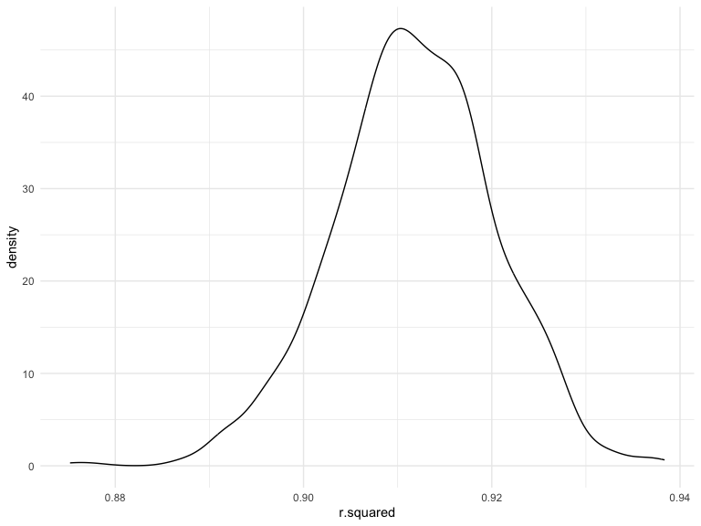
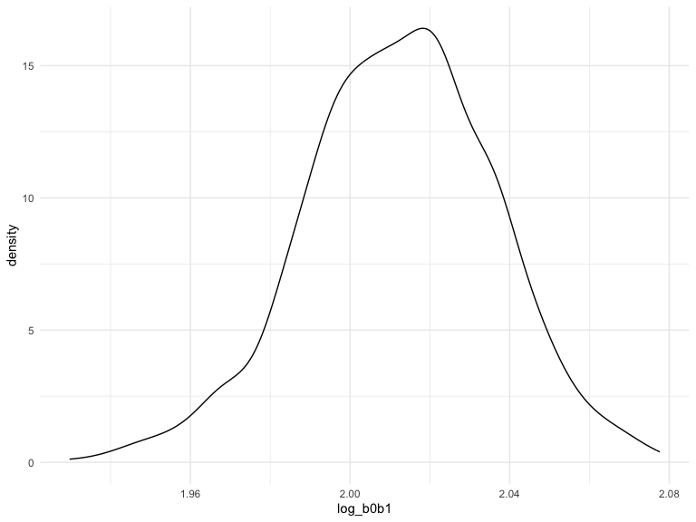

p8105_hw6_bh2849
================
Binyue Hu
2022-12-03

``` r
library(tidyverse)
library(modelr)
```

### Problem 1

To obtain a distribution for $\hat{r}^2$, we’ll follow basically the
same procedure we used for regression coefficients: draw bootstrap
samples; the a model to each; extract the value I’m concerned with; and
summarize. Here, we’ll use `modelr::bootstrap` to draw the samples and
`broom::glance` to produce `r.squared` values.

``` r
weather_df = 
  rnoaa::meteo_pull_monitors(
    c("USW00094728"),
    var = c("PRCP", "TMIN", "TMAX"), 
    date_min = "2017-01-01",
    date_max = "2017-12-31") %>%
  mutate(
    name = recode(id, USW00094728 = "CentralPark_NY"),
    tmin = tmin / 10,
    tmax = tmax / 10) %>%
  select(name, id, everything())
```

    ## Registered S3 method overwritten by 'hoardr':
    ##   method           from
    ##   print.cache_info httr

    ## using cached file: ~/Library/Caches/R/noaa_ghcnd/USW00094728.dly

    ## date created (size, mb): 2022-10-04 10:49:20 (8.408)

    ## file min/max dates: 1869-01-01 / 2022-10-31

``` r
weather_df %>% 
  modelr::bootstrap(n = 1000) %>% 
  mutate(
    models = map(strap, ~lm(tmax ~ tmin, data = .x) ),
    results = map(models, broom::glance)) %>% 
  select(-strap, -models) %>% 
  unnest(results) %>% 
  ggplot(aes(x = r.squared)) + geom_density()
```



In this example, the $\hat{r}^2$ value is high, and the upper bound at 1
may be a cause for the generally skewed shape of the distribution. If we
wanted to construct a confidence interval for $R^2$, we could take the
2.5% and 97.5% quantiles of the estimates across bootstrap samples.
However, because the shape isn’t symmetric, using the mean +/- 1.96
times the standard error probably wouldn’t work well.

We can produce a distribution for $\log(\beta_0 * \beta1)$ using a
similar approach, with a bit more wrangling before we make our plot.

``` r
weather_df %>% 
  modelr::bootstrap(n = 1000) %>% 
  mutate(
    models = map(strap, ~lm(tmax ~ tmin, data = .x) ),
    results = map(models, broom::tidy)) %>% 
  select(-strap, -models) %>% 
  unnest(results) %>% 
  select(id = `.id`, term, estimate) %>% 
  pivot_wider(
    names_from = term, 
    values_from = estimate) %>% 
  rename(beta0 = `(Intercept)`, beta1 = tmin) %>% 
  mutate(log_b0b1 = log(beta0 * beta1)) %>% 
  ggplot(aes(x = log_b0b1)) + geom_density()
```



As with $r^2$, this distribution is somewhat skewed and has some
outliers.

The point of this is not to say you should always use the bootstrap –
it’s possible to establish “large sample” distributions for strange
parameters / values / summaries in a lot of cases, and those are great
to have. But it is helpful to know that there’s a way to do inference
even in tough cases.

### Problem 2

#### Load and Tidy the Data

``` r
homicides_data = read_csv("./data/homicide-data.csv")

homicides_data = homicides_data %>% 
  janitor::clean_names() %>% 
  mutate(city_state = str_c(city, state, sep = "_")) %>% 
  filter(!city_state %in% c("Dallas_TX", "Phoenix_AZ", "Kansas City_MO", "Tulsa_AL"), 
         victim_race %in% c("Black", "White")) %>% 
  mutate(victim_age = as.numeric(victim_age),
         resolved = case_when(
           disposition == "Closed without arrest" ~ 0,
           disposition == "Open/No arrest" ~ 0,
           disposition == "Closed by arrest" ~ 1
         ))
```

### Fit Logistic Regression for Baltimore

``` r
baltimore_glm = homicides_data %>% 
  filter(city_state == "Baltimore_MD") %>% 
  glm(resolved ~ victim_age + victim_sex + victim_race, family = binomial(), data = .) %>% 
  broom::tidy() %>% 
  mutate(odds_ratio = exp(estimate),
         CI_lower = exp(estimate - 1.96 * std.error),
         CI_upper = exp(estimate + 1.96 * std.error)) %>% 
  filter(term == "victim_sexMale") %>%
  select(term, odds_ratio, CI_lower, CI_upper) 

baltimore_glm
```

    ## # A tibble: 1 × 4
    ##   term           odds_ratio CI_lower CI_upper
    ##   <chr>               <dbl>    <dbl>    <dbl>
    ## 1 victim_sexMale      0.426    0.325    0.558

### For All Cities

``` r
cities_glm = homicides_data %>% 
  nest(cities = -city_state) %>%
  mutate(models = map(.x = cities, ~glm(resolved ~ victim_age + victim_sex + victim_race, family = binomial(), data = .)),
         results = map(models, broom::tidy)) %>% 
  select(-models, -cities) %>% 
  unnest(cols = results) %>% 
  mutate(odds_ratio = exp(estimate),
         CI_lower = exp(estimate - 1.96 * std.error),
         CI_upper = exp(estimate + 1.96 * std.error)) %>% 
  filter(term == "victim_sexMale") %>% 
  select(city_state, odds_ratio, CI_lower, CI_upper)

cities_glm
```

    ## # A tibble: 47 × 4
    ##    city_state     odds_ratio CI_lower CI_upper
    ##    <chr>               <dbl>    <dbl>    <dbl>
    ##  1 Albuquerque_NM      1.77     0.831    3.76 
    ##  2 Atlanta_GA          1.00     0.684    1.46 
    ##  3 Baltimore_MD        0.426    0.325    0.558
    ##  4 Baton Rouge_LA      0.381    0.209    0.695
    ##  5 Birmingham_AL       0.870    0.574    1.32 
    ##  6 Boston_MA           0.674    0.356    1.28 
    ##  7 Buffalo_NY          0.521    0.290    0.935
    ##  8 Charlotte_NC        0.884    0.557    1.40 
    ##  9 Chicago_IL          0.410    0.336    0.501
    ## 10 Cincinnati_OH       0.400    0.236    0.677
    ## # … with 37 more rows

### Plot for adjusted OR and 95% CI

``` r
or_plot = cities_glm %>% 
  mutate(city_state = fct_reorder(city_state, odds_ratio)) %>% 
  ggplot(aes(x = city_state, y = odds_ratio, color = odds_ratio)) +
  geom_point() +
  ylim(0, 5) +
  geom_errorbar(aes(ymin = CI_lower, ymax = CI_upper, width = .3)) + 
  theme(axis.text.x = element_text(angle = 90, vjust = 0.5, hjust = 1)) + 
    labs(
    x = "Cities",
    y = "Adjusted odds ratio",
    title = "Odds Ratio of Solving Homicides in Major U.S. Cities Comparing Male to Female Victims")
or_plot
```


-   On the plot, we can see that most of the cities have odd ratio
    between 0 and 1 for solving homicides comparing male victims to
    female victims, which means that the odds of having a resolved
    homicide among male victims is lower than the odds of having a
    resolved homicide among female victims in those cities, adjusting
    for victim age and victim race.

-   `New York, NY` has the lowest adjusted odds ratio, and
    `Albuquerque, MM` has the highest adjusted odds ratio.

-   `Fresno, CA`, `Stockton, CA` and `Albuquerque, NM` are the 3 cities
    with the highest adjusted ORs, the wide 95% CI showing there may be
    a high variability in these estimates rather than an effect of
    victim sex on solving homicides.

### Problem 3

#### Load and Tidy Data

``` r
birthweight_data = read_csv("./data/birthweight.csv")
```

    ## Rows: 4342 Columns: 20
    ## ── Column specification ────────────────────────────────────────────────────────
    ## Delimiter: ","
    ## dbl (20): babysex, bhead, blength, bwt, delwt, fincome, frace, gaweeks, malf...
    ## 
    ## ℹ Use `spec()` to retrieve the full column specification for this data.
    ## ℹ Specify the column types or set `show_col_types = FALSE` to quiet this message.

``` r
birthweight_data = birthweight_data %>% 
  janitor::clean_names() %>% 
  mutate(
    babysex = as.factor(babysex),
    frace = as.factor(frace),
    malform = as.factor(malform),
    mrace = as.factor(mrace)
    )
```

There are 0 missing data, so we don’t need to worry about that.

#### Model 1

``` r
m1 = lm(bwt ~ wtgain + mheight, data = birthweight_data)

summary(m1) %>% 
  broom::tidy()
```

    ## # A tibble: 3 × 5
    ##   term        estimate std.error statistic  p.value
    ##   <chr>          <dbl>     <dbl>     <dbl>    <dbl>
    ## 1 (Intercept)    657.    177.         3.71 2.11e- 4
    ## 2 wtgain          11.2     0.677     16.5  2.99e-59
    ## 3 mheight         34.8     2.79      12.5  3.76e-35

``` r
m1_plot = birthweight_data %>% 
  select(bwt, wtgain, mheight) %>% 
  modelr::add_residuals(m1) %>% 
  modelr::add_predictions(m1) %>% 
  ggplot(aes(x = pred, y = resid)) + 
  geom_violin() +
  geom_point(alpha = 0.5)  +
  labs(title = "Predictions vs. Residuals",
       x = "Predictions", 
       y = "Residuals",) +
  theme(plot.title = element_text(hjust = 0.5))
  
m1_plot
```


-   I picked the variable `wtgain` and `mheight` as the predictor for
    model 1 based on a hypothesized structure for the factors that
    underly birthweight. I think mother’s weight gain and height during
    pregnancy is closely related to baby’s birthweight.
-   The `Prediction vs Residual` plot generated shows a big cluster of
    points around fitted values equal 2000 - 4000 where the model
    residuals tend to evenly distributed around 0.

#### Model 2 & Model 3

``` r
m2 = lm(bwt ~ blength + gaweeks, data = birthweight_data)

summary(m2) %>% 
  broom::tidy()
```

    ## # A tibble: 3 × 5
    ##   term        estimate std.error statistic  p.value
    ##   <chr>          <dbl>     <dbl>     <dbl>    <dbl>
    ## 1 (Intercept)  -4348.      98.0      -44.4 0       
    ## 2 blength        129.       1.99      64.6 0       
    ## 3 gaweeks         27.0      1.72      15.7 2.36e-54

``` r
m3 = lm(bwt ~ bhead + blength + babysex + bhead * blength + bhead * babysex + blength * babysex + bhead * blength * babysex, data = birthweight_data)

summary(m3) %>% 
  broom::tidy()
```

    ## # A tibble: 8 × 5
    ##   term                    estimate std.error statistic      p.value
    ##   <chr>                      <dbl>     <dbl>     <dbl>        <dbl>
    ## 1 (Intercept)            -7177.     1265.       -5.67  0.0000000149
    ## 2 bhead                    182.       38.1       4.78  0.00000184  
    ## 3 blength                  102.       26.2       3.90  0.0000992   
    ## 4 babysex2                6375.     1678.        3.80  0.000147    
    ## 5 bhead:blength             -0.554     0.780    -0.710 0.478       
    ## 6 bhead:babysex2          -198.       51.1      -3.88  0.000105    
    ## 7 blength:babysex2        -124.       35.1      -3.52  0.000429    
    ## 8 bhead:blength:babysex2     3.88      1.06      3.67  0.000245

#### Croddvalidation

``` r
cv_df = crossv_mc(birthweight_data, 100) %>% 
  mutate(train = map(train, as_tibble),
         test = map(test, as_tibble)) %>% 
  mutate(m1_cv = map(train, ~lm(bwt ~ wtgain + mheight, data = .x)),
         m2_cv = map(train, ~lm(bwt ~ blength + gaweeks, data = .x)),
         m3_cv = map(train, ~lm(bwt ~ bhead + blength + babysex + bhead*blength + bhead*babysex + blength*babysex + bhead*blength*babysex, data = .x))) %>% 
  mutate(rmse_m1 = map2_dbl(m1_cv, test, ~rmse(model = .x, data = .y)),
         rmse_m2 = map2_dbl(m2_cv, test, ~rmse(model = .x, data = .y)), 
         rmse_m3 = map2_dbl(m3_cv, test, ~rmse(model = .x, data = .y)))
```

``` r
cv_plot = cv_df %>% 
  select(starts_with("rmse")) %>% 
  pivot_longer(everything(),
               names_to = "model",
               values_to = "rmse",
               names_prefix = "rmse_") %>% 
  ggplot(aes(x = model, y = rmse)) + 
  geom_violin() +
  labs (
    title = "Cross Validation Comparisons",
    x = "Model",
    y = "RMSE"
  )

cv_plot
```


-   From the plot, we can see that model 1 has the highest RMSE and
    model 3 has the lowest RMSE.
-   We should select model 3 as a better choice to predict birth weight
    of babies because the lower RMSE the better.
